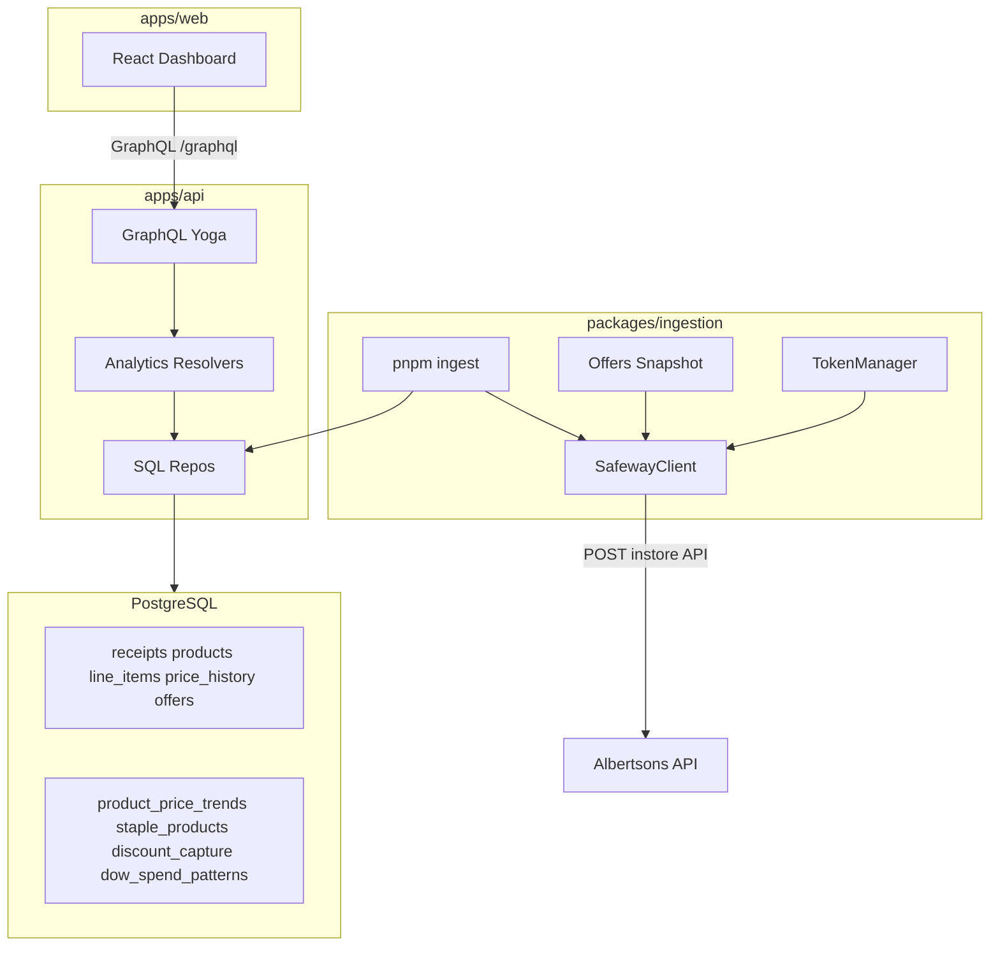

# Safeway Analytics Architecture

## Overview

Safeway Analytics is a personal grocery analytics application. It ingests in-store receipt data from the Albertsons/Safeway API, stores purchase history in PostgreSQL, and surfaces spending insights through a React dashboard backed by a GraphQL API.

**Scope:** Single-user, analysis-only — no purchasing, multi-user auth, or external price comparison in v1.

## Service topology



| Service | Stack | Responsibility |
|---------|-------|----------------|
| Web | React, Vite, Tailwind, Recharts | Spend dashboards, staples, price trends |
| GraphQL API | TypeScript, Yoga, Pothos, `pg` | Analytics queries, receipt/product reads |
| Ingestion | TypeScript CLI | Receipt backfill, offer snapshots, token refresh |
| Shared | TypeScript, Zod | Safeway API types, env schema, constants |
| Database | PostgreSQL 16 + pgvector | Receipt domain + analytics views |

## Monorepo layout

```
safeway-analytics/
├── apps/
│   ├── api/                 # @safeway-analytics/api — GraphQL server
│   └── web/                 # @safeway-analytics/web — React dashboard
├── packages/
│   ├── ingestion/           # @safeway-analytics/ingestion — CLI + cron
│   └── shared/              # @safeway-analytics/shared — types + env
├── db/sql/                  # Flyway versioned migrations (V1__*.sql)
├── docs/
├── docker-compose.yml
├── .env.example
└── PRD.md
```

Workspace packages use `@safeway-analytics/*` naming. Env is loaded from the repo-root `.env` by all services.

## Data model

Core tables (see [PRD.md](../PRD.md) for full DDL):

- **receipts** — trip headers with totals, store metadata, `raw_payload` JSONB
- **products** — `bpn`-first product identity with department and normalized name
- **line_items** — per-receipt product rows with discount breakdown
- **price_history** — append-only observed prices per purchase
- **offers** — append-only J4U offer snapshots (weekly cron)
- **categories** — optional hierarchy (future enrichment)

Analytics views:

- `product_price_trends` — materialized, 90-day rolling stats
- `staple_products` — frequency-based staple classification
- `discount_capture` — savings rate by department
- `dow_spend_patterns` — day-of-week basket averages

Migrations: [`db/sql/`](../db/sql/).

## Ingestion pipeline

```
SafewayClient.fetchReceiptList()
  → skip receipts already in DB by _id
  → for each new receipt:
      fetchReceiptDetail(id)
      → upsert receipt header
      → resolveProduct(bpn ?? upc ?? normalizedName)
      → upsert line_items + append price_history
  → refresh materialized view product_price_trends
  → rate limit: 1 req/sec

SafewayClient.fetchOffers(storeId)   ← no auth required
  → snapshotOffers()                 ← append-only, never overwrite
  → run weekly via cron (pnpm ingest:offers)
```

Product matching uses Albertsons `bpn` (Buyer Product Number) as the primary key. Items without `bpn` fall back to normalized name hashing.

## Token management

Okta session TTL is ~90 days. v1 strategy:

1. Store JWT in repo-root `.env` as `JWT_TOKEN`
2. `TokenManager` decodes `exp` and proactively refreshes when within 24h of expiry
3. On 401, attempt one refresh + retry
4. If refresh fails, CLI exits with re-login instructions (Playwright automation deferred)

# SECURITY-REVIEW: JWT and clubcard values must never be logged or committed.

## Staples classification

| Trip count | Threshold | UI behavior |
|-----------|-----------|-------------|
| < 5 | — | Cold-start: suppress staples, show onboarding |
| 5–9 | ≥50% | Provisional staples, "building history" label |
| ≥10 | ≥60% | Full staple classification |

## Ports (local dev)

| Service | Port |
|---------|------|
| Postgres | 5435 |
| GraphQL API | 4001 |
| Vite web | 5174 |

## Dev workflow

See [README.md](../README.md) for quick start. Summary:

```bash
cp .env.example .env          # fill CLUBCARD, JWT_TOKEN, etc.
docker compose up -d db
pnpm db:migrate
pnpm install
pnpm ingest                   # backfill receipts (after ingestion package exists)
pnpm ingest:offers            # snapshot J4U offers
pnpm dev                      # API + web concurrently
```

## Auth (non-goal for v1)

Personal single-user app — no login UI. API runs locally without auth middleware. Do not expose the GraphQL endpoint to the public internet without adding authentication.

## Phase 4 (deferred)

- Discount capture UI ("You missed $X")
- Price alerts above 90-day average
- Store brand vs name brand comparison
- DOW insight callouts
- LLM product normalization for items missing `bpn`
- OS keychain JWT storage
- Playwright automated Okta re-login

See [PRD.md](../PRD.md) for full product requirements and open questions.
