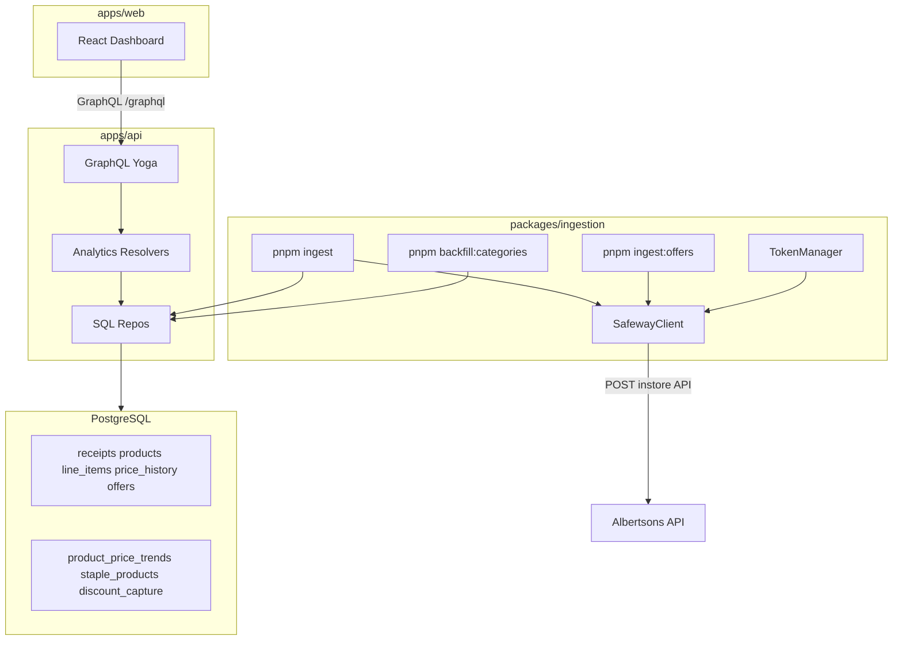

# Safeway Analytics Architecture

## Overview

Safeway Analytics is a personal grocery analytics application. It ingests in-store receipt data from the Albertsons/Safeway API, stores purchase history in PostgreSQL, and surfaces spending insights through a React dashboard backed by a GraphQL API.

**Scope:** Single-user, analysis-only — no purchasing, multi-user auth, or external price comparison in v1.

**Status:** MVP-A complete. Follow-up phases: [ROADMAP.md](./ROADMAP.md).

## Service topology



| Service | Stack | Responsibility |
|---------|-------|----------------|
| Web | React, Vite, Tailwind, Recharts, TanStack Query | Spend dashboards, staples, category/meat insights, deal timing |
| GraphQL API | TypeScript, Yoga, Pothos, `pg` | Analytics queries, receipts, offers, price trends |
| Ingestion | TypeScript CLI | Receipt sync, category backfill, offer snapshots |
| Shared | TypeScript, Zod | Safeway API types, env schema, staples/DOW constants, `productCategory` rules |
| Database | PostgreSQL 16 + pgvector | Receipt domain + analytics views (pgvector reserved for Phase E) |

## Monorepo layout

```
safeway-analytics/
├── apps/
│   ├── api/                 # @safeway-analytics/api — GraphQL server
│   │   └── src/
│   │       ├── schema/      # Pothos builder, queries, types
│   │       └── repos/       # analytics.ts, receipts.ts, offers.ts
│   └── web/                 # @safeway-analytics/web — React dashboard
│       └── src/
│           ├── components/  # charts, StapleInsightsPanel, MeatInsightsPanel, …
│           ├── pages/       # Dashboard.tsx
│           └── graphql/     # queries + hand-written types
├── packages/
│   ├── ingestion/           # ingest, snapshotOffers, backfillCategories, probe
│   └── shared/              # safeway types, constants, productCategory
├── db/sql/                  # Flyway V1–V8
├── docs/
│   ├── ARCHITECTURE.md
│   ├── ROADMAP.md
│   └── api-discovery/
├── docker-compose.yml
├── .env.example
└── PRD.md
```

Workspace packages use `@safeway-analytics/*` naming. Env is loaded from the repo-root `.env` by all services.

## Data model

Core tables (see [PRD.md](../PRD.md) for DDL detail):

- **receipts** — trip headers with totals, store metadata, `raw_payload` JSONB
- **products** — `bpn`-first identity; `shopping_category_id` / `shopping_category_label` (V7)
- **line_items** — per-receipt rows with discount breakdown
- **price_history** — append-only observed prices; `price_unit` = `each` | `lb` (V8)
- **offers** — append-only J4U snapshots (weekly cron when ingest works)
- **categories** — optional hierarchy (future)

Analytics views (SQL):

- **product_price_trends** — materialized, rolling stats (refreshed on ingest)
- **staple_products** — frequency view (API applies 90d window + weekly basis on top)
- **discount_capture** — savings rate by department

**Not in DB:** `dow_deal_patterns` was removed (V6); `dowDealPatterns` is computed in `apps/api/src/repos/analytics.ts` with configurable lookback (90–365 days, default 365).

## Ingestion pipeline

```
SafewayClient.fetchReceiptList()
  → skip receipts already in DB by _id
  → for each new receipt:
      fetchReceiptDetail(id)
      → upsert receipt header
      → resolveProduct(bpn ?? upc ?? normalizedName)
        → assign shopping_category_id via productCategory rules
      → upsert line_items + append price_history (price_unit from weight/meat rules)
  → refresh materialized view product_price_trends
  → rate limit: 1 req/sec

pnpm backfill:categories
  → re-apply productCategory rules to all products (no API calls)

SafewayClient.fetchOffers(storeId)   ← requires API key from HAR (currently blocked)
  → snapshotOffers()                 ← append-only
  → intended weekly via cron (pnpm ingest:offers)
```

Product matching uses Albertsons `bpn` as the primary key. Items without `bpn` fall back to normalized name hashing.

**Weight items:** Safeway `reduced_price` on meat/produce sold by weight is already $/lb; `quantity` is pounds. Packaged (non-weight) items use `price_unit = each`.

## GraphQL surface (MVP-A)

| Query | Purpose |
|-------|---------|
| `spendSummary` | Totals, avg weekly, savings |
| `monthlySpend` / `weeklyTrend` | Time series |
| `categoryBreakdown` | Department donut |
| `staples` | SKU staples (90d, weekly %) |
| `stapleCategoryInsights` | Binned categories + near-staples + price trend + best day |
| `meatCategoryInsights` | Salmon/poultry/beef/pork $/lb |
| `dowDealPatterns` | Deal score by DOW, recommended day |
| `dowPatterns` | Legacy avg-basket by DOW (still exposed) |
| `highCostProducts` | Unit price + cumulative spend leaderboards |
| `priceTrend` | Per-product history + volatility |
| `discountCapture` | Department savings (not yet in UI) |
| `receipts` | Paginated trip list (not yet in UI) |
| `offers` | Latest offer snapshot (empty until ingest works) |

Constants (`STAPLE_LOOKBACK_DAYS`, `DOW_DEAL_LOOKBACK_DAYS`, thresholds) live in `packages/shared/src/constants.ts`.

## Token management

Okta session TTL is ~90 days. v1 strategy:

1. Store JWT in repo-root `.env` as `JWT_TOKEN`
2. `TokenManager` decodes `exp`; proactive refresh when within 24h of expiry (when refresh endpoint works)
3. On 401, attempt one refresh + retry
4. If refresh fails, CLI exits with re-login instructions (Playwright automation deferred to Phase E)

# SECURITY-REVIEW: JWT and clubcard values must never be logged or committed.

## Staples classification

| Window state | Threshold | UI behavior |
|--------------|-----------|-------------|
| &lt; 5 trips or &lt; 4 active weeks (90d) | — | Cold start: suppress staples |
| 4–9 active weeks | ≥50% of weeks | Provisional, "building history" |
| ≥10 active weeks | ≥50% of weeks | Full staples |

Frequency is **% of active shopping weeks** in the last **90 days**, not all-time trip count.

## Web dashboard components

| Component | Data source |
|-----------|-------------|
| `MetricCards` | `spendSummary` |
| `MonthlySpendChart` / `WeeklyTrendChart` | `monthlySpend`, `weeklyTrend` |
| `CategoryDonut` | `categoryBreakdown` |
| `StaplesPanel` | `staples` |
| `StapleInsightsPanel` / `CategoryInsightCard` | `stapleCategoryInsights` |
| `MeatInsightsPanel` | `meatCategoryInsights` |
| `DowDealChart` | `dowDealPatterns` |
| `HighCostPanel` / `PriceTrendView` | `highCostProducts`, `priceTrend` |
| `ColdStartBanner` | `staples.mode` |

## Ports (local dev)

| Service | Port |
|---------|------|
| Postgres | 5435 |
| GraphQL API | 4001 |
| Vite web | 5174 |

## Dev workflow

```bash
cp .env.example .env
docker compose up -d db
pnpm db:migrate
pnpm install
pnpm ingest
pnpm backfill:categories   # after changing productCategory rules
pnpm dev:all               # API :4001 + web :5174
```

See [README.md](../README.md) for full script list and cron examples.

## Auth (non-goal for v1)

Personal single-user app — no login UI. API runs locally without auth middleware. Do not expose the GraphQL endpoint to the public internet without adding authentication.

## Deferred work

See [ROADMAP.md](./ROADMAP.md) for MVP-B (discount UI, receipts, offers fix), MVP-C (offer matching), and Phase D–E (tests, alerts, LLM normalization).
