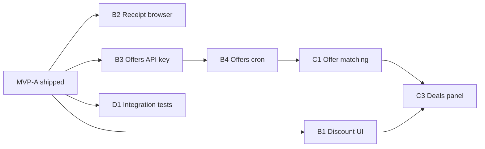

# Safeway Analytics — Roadmap

This document supersedes the open items at the bottom of [PRD.md](../PRD.md). **MVP-A** (ingest → Postgres → GraphQL → dashboard) is complete. Work below is ordered by value and dependency.

**Last updated:** 2026-05-23

---

## What shipped (MVP-A)

| Area | Delivered |
|------|-----------|
| Data | Receipt ingest, `bpn`-first products, `price_history`, Flyway V1–V8 |
| Analytics | 90d weekly staples, high-cost, price trends, DOW deal score (365d default) |
| Binning | Shopping categories (bread, yogurt, coffee, pasta sauce, meat, …) + backfill CLI |
| API | Full analytics GraphQL surface; `receipts` pagination; `discountCapture` / `offers` (data-dependent) |
| UI | Dashboard panels for spend, staples, categories, meat $/lb, deal timing, cold start |

**Known blockers:** J4U offers ingest (`pnpm ingest:offers`) — API key not yet extracted from HAR. Manual JWT refresh when Okta session expires.

---

## MVP-B — Close the loop (1–2 weeks)

Goal: finish PRD-visible gaps without new data science — mostly UI and ops.

| # | Task | Description | Depends on |
|---|------|-------------|------------|
| B1 | **Discount capture panel** | Render `discountCapture` — savings by department, total saved vs spend | — |
| B2 | **Receipt browser** | Paginated trip list from `receipts`; link to line items / totals | — |
| B3 | **Offers API key** | Capture `x-api-key` (or equivalent) from browser HAR; fix `SafewayClient.fetchOffers` | Probe success |
| B4 | **Offers ingest + cron** | `pnpm ingest:offers` weekly; document ingest cron alongside offers | B3 |
| B5 | **Scheduled receipt ingest** | Crontab example + optional `pnpm ingest` dry-run flag in README | — |
| B6 | **Dashboard layout** | Tabs or sections: Spend / Staples / Prices / Deals — reduce single-page scroll | B1, B2 |

**Exit criteria:** Dashboard shows realized savings by department; you can open any trip; offers table populates after weekly snapshot.

---

## MVP-C — Offer intelligence (2–3 weeks)

Goal: answer “what deals am I missing?” using offer history + purchase history.

| # | Task | Description | Depends on |
|---|------|-------------|------------|
| C1 | **Offer ↔ product matching** | Match offers to `products` via UPC/BPN/description rules | B4 |
| C2 | **Missed deals estimate** | For staples/categories, flag active offers not seen on recent receipts | C1 |
| C3 | **Deals panel** | UI: active offers for home store, matched staples, estimated missed $ | C2, B1 |
| C4 | **Offer trend storage** | Query offer price/availability over snapshots (same offer id across weeks) | B4 |

**Exit criteria:** Monthly “you had X personalized deals on items you buy; captured Y” with drill-down.

---

## Phase D — Reliability & trust (ongoing)

| # | Task | Description |
|---|------|-------------|
| D1 | **Analytics integration tests** | Small Postgres fixture; assert sort order, staple thresholds, deal score |
| D2 | **Single staple source of truth** | Align `staple_products` SQL view with API window logic or drop view |
| D3 | **GraphQL codegen** | Generate web types from schema or document “hand-maintained” choice |
| D4 | **Configurable thresholds in UI** | Staple % (40–60), DOW lookback (90–365) without code change |
| D5 | **Ingest observability** | Structured log summary: new/skipped/failed receipts per run |

---

## Phase E — Enrichment (when MVP-C is boring)

| # | Task | Description |
|---|------|-------------|
| E1 | **Price alerts** | Notify when paid price &gt; 90d average for staple SKUs |
| E2 | **Brand comparison** | O Organics vs name brand within a shopping category |
| E3 | **Packaged meat series** | Per-unit trends for non-weight poultry (complement $/lb panel) |
| E4 | **LLM product normalization** | Batch classify items missing `bpn`; cache embeddings in pgvector |
| E5 | **Okta Playwright login** | Automated re-auth when refresh fails |
| E6 | **OS keychain JWT** | Stop storing long-lived token in plain `.env` |

---

## Phase F — Optional / non-goals

Explicitly out of scope unless requirements change:

- Multi-user / household sharing
- External retailer price comparison
- Nutritional analysis
- In-app purchasing

---

## Suggested execution order

**Quick wins this week:** B1, B2, B5 (documentation + cron only).

**Highest leverage after that:** B3 → B4 → C1 → C3.

---

## Migration reference

| Version | Purpose |
|---------|---------|
| V1 | pgvector extension |
| V2 | Core schema |
| V3 | Analytics views + materialized price trends |
| V4 | Staple threshold 50% |
| V5 | Staples window metadata |
| V6 | Drop static `dow_deal_patterns` view (API-computed) |
| V7 | `shopping_category_id` on products |
| V8 | `price_unit` on price_history (`each` / `lb`) |

---

## Doc maintenance

When completing a roadmap item:

1. Check the box in this file (or move to “Done” section).
2. Update [PRD.md](../PRD.md) Phase 4 table if it maps to an original requirement.
3. Update [README.md](../README.md) dashboard bullet list if user-facing.
